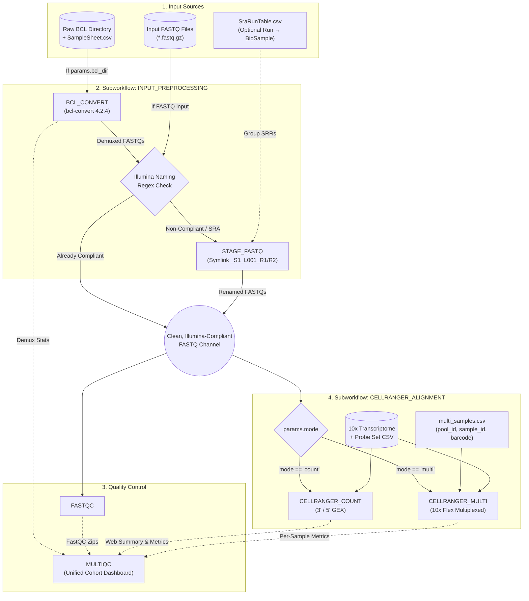

This document highlights the pipeline contained herein and some of the applications and uses.

```mermaid
flowchart TD
    subgraph Inputs ["1. Input Sources"]
        BCL[("Raw BCL Directory\n+ SampleSheet.csv")]
        FASTQ_RAW[("Input FASTQ Files\n(*.fastq.gz)")]
        META["SraRunTable.csv\n(Optional Run → BioSample)"]
    end

    subgraph Preproc ["2. Subworkflow: INPUT_PREPROCESSING"]
        BCL_CONV["BCL_CONVERT\n(bcl-convert 4.2.4)"]
        REGEX{"Illumina Naming\nRegex Check"}
        STAGE["STAGE_FASTQ\n(Symlink _S1_L001_R1/R2)"]
    end

    CLEAN_CH(("Clean, Illumina-Compliant\nFASTQ Channel"))

    subgraph QC_Step ["3. Quality Control"]
        FQC["FASTQC"]
        MQC["MULTIQC\n(Unified Cohort Dashboard)"]
    end

    subgraph Align ["4. Subworkflow: CELLRANGER_ALIGNMENT"]
        MODE{"params.mode"}
        COUNT["CELLRANGER_COUNT\n(3' / 5' GEX)"]
        MULTI["CELLRANGER_MULTI\n(10x Flex Multiplexed)"]
        MULTI_CSV["multi_samples.csv\n(pool_id, sample_id, barcode)"]
        REF[("10x Transcriptome\n+ Probe Set CSV")]
    end

    %% Input to Preprocessing
    BCL -->|If params.bcl_dir| BCL_CONV
    BCL_CONV -->|Demuxed FASTQs| REGEX
    FASTQ_RAW -->|If FASTQ input| REGEX

    %% Regex Routing to Clean Channel
    REGEX -->|Already Compliant| CLEAN_CH
    REGEX -->|Non-Compliant / SRA| STAGE
    META -.->|Group SRRs| STAGE
    STAGE -->|Renamed FASTQs| CLEAN_CH

    %% Clean Channel fans out to QC and Alignment
    CLEAN_CH --> FQC
    CLEAN_CH --> MODE

    %% Alignment Routing
    MODE -->|mode == 'count'| COUNT
    MODE -->|mode == 'multi'| MULTI
    MULTI_CSV --> MULTI
    REF --> COUNT
    REF --> MULTI

    %% Reporting Links to MultiQC
    BCL_CONV -.->|Demux Stats| MQC
    FQC -.->|FastQC Zips| MQC
    COUNT -.->|Web Summary & Metrics| MQC
    MULTI -.->|Per-Sample Metrics| MQC
```